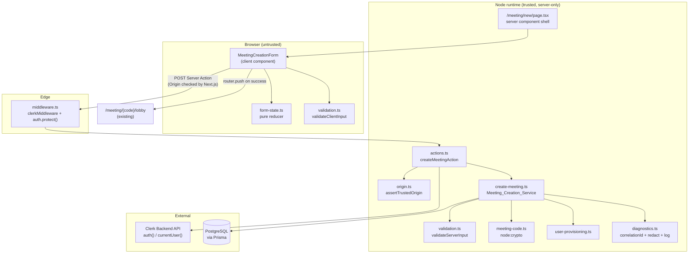
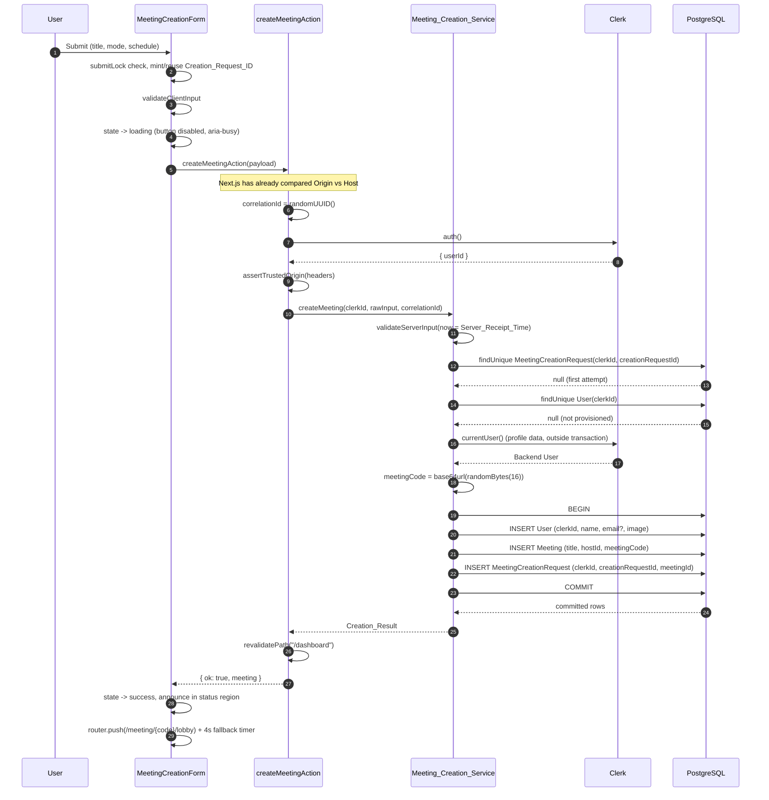
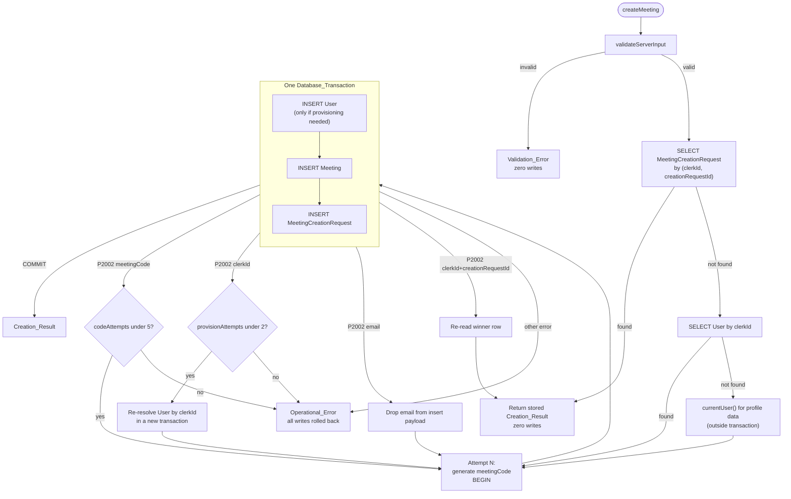
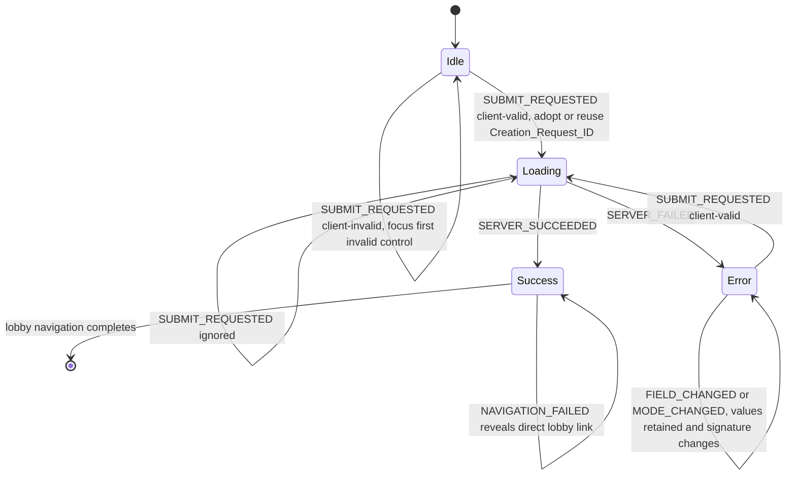
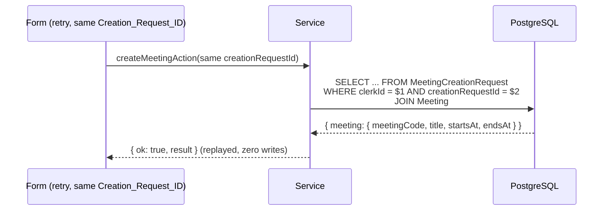

# Design Document

## Overview

The Meeting Creation feature adds the missing `/meeting/new` destination and the server-side pipeline behind it. The dashboard already links to `/meeting/new` (`src/app/dashboard/page.tsx`, "Create New Meeting"), and `src/middleware.ts` already protects every non-public route, so the feature is additive: one new protected page, one Server Action, a server-only service layer, a shared validation module, one new Prisma model for idempotency, and three additive design tokens.

### Scope boundaries

| In scope | Out of scope |
| --- | --- |
| `/meeting/new` page, form, and Server Action | Editing or deleting a meeting |
| Clerk-to-Prisma user provisioning by `clerkId` | Clerk webhook-based user sync |
| Meeting code generation and uniqueness | Join-by-code flow, LiveKit room lifecycle |
| Idempotency for repeated creation attempts | Recurring meetings, invitations, participants |
| Dashboard visibility of new meetings | Dashboard redesign (existing behavior already satisfies Req 9.6-9.8) |

### Existing code the design builds on

| File | Established behavior the design relies on |
| --- | --- |
| `src/middleware.ts` | `clerkMiddleware` + `auth.protect()` for every route not in `isPublicRoute`. `/meeting/new` is not public, so Req 1.2-1.4 are already enforced. No change needed. |
| `src/lib/prisma.ts` | Prisma singleton (`prisma`) reused by the service. No change needed. |
| `prisma/schema.prisma` | `User.clerkId` is nullable + unique; `User.email` is nullable + unique; `Meeting.meetingCode` is unique; `Meeting.createdAt` has `@default(now())`; `Meeting.hostId` is an FK to the local cuid `User.id`. |
| `src/app/dashboard/page.tsx` | Calls `noStore()`, queries by `host.is.clerkId` / `participants.some.user.is.clerkId`, splits upcoming vs past on `endsAt`, sorts on `startsAt ?? createdAt`. Instant meetings (`endsAt === null`) already land in "upcoming" sorted by `createdAt`. No change needed. |
| `src/app/meeting/[code]/lobby/page.tsx` | Calls `noStore()` and looks a meeting up by `meetingCode`, so a freshly committed meeting is immediately readable with no cache staleness. |
| `src/components/meeting/pre-join-lobby.tsx` | Client-component conventions: `"use client"`, `useRouter`, refs to guard async races, shadcn primitives, lucide icons. |
| `src/app/api/meetings/token/route.ts` | Existing server conventions: `auth()` first, narrow runtime type guards on untrusted bodies, `console.error` for diagnostics, safe generic messages to the client. |

### Key decisions

| # | Decision | Rationale | Requirements |
| --- | --- | --- | --- |
| D1 | Server Action, not Route Handler | Next.js compares the request `Origin` against the host for every Server Action and aborts before the action body runs, giving the CSRF property for free. A Route Handler would require hand-rolled origin checking. | 10.6, 10.7 |
| D2 | Explicit in-service origin assertion in addition to the framework check | The framework abort surfaces as a generic framework error, not a typed `Authorization_Error`. The explicit guard produces the required taxonomy value and is defense-in-depth against proxy misconfiguration. | 10.6, 10.7 |
| D3 | New `MeetingCreationRequest` model keyed `@@unique([clerkId, creationRequestId])` | The uniqueness guarantee in Req 6.7 must be enforced by the database, not by application logic. Scoping on the Clerk subject string (not the local `User.id`) matches Req 10.9 exactly and avoids joining through a nullable column. | 6.7, 6.8, 6.9, 10.9 |
| D4 | Hand-written shared validation module, no new validation dependency | Four fields, one form. Adding zod for this costs a dependency and client bundle weight; the rules (code-point counting, control-character classes, strict ISO-8601-with-offset) need custom predicates regardless. | 4.x, 5.x |
| D5 | `randomBytes(16).toString("base64url")` for the meeting code | 16 bytes is exactly 128 bits and base64url of 16 bytes is exactly 22 unpadded characters drawn from `A-Za-z0-9-_`, which is precisely the required alphabet and length. No custom encoder, no modulo bias. | 7.1, 7.2 |
| D6 | Rely on the unique index for collision detection; no pre-read of the code | A `SELECT` before `INSERT` adds a round trip and leaves a time-of-check/time-of-use window. The unique index is authoritative. | 7.3, 7.4 |
| D7 | Retry the whole transaction on conflict, with separate attempt budgets for code collisions and provisioning conflicts | PostgreSQL aborts a transaction after a constraint violation, so a `P2002` cannot be recovered from inside the same transaction. Recovery must be a fresh transaction. Separate counters keep a provisioning race from consuming the five code attempts Req 7.5 allocates. | 2.8, 7.4, 7.5, 8.10 |
| D8 | Pure reducer for the form state machine, held in `src/lib/meetings/form-state.ts` | Makes the duplicate-submit guard, the request-ID lifecycle, and value retention testable as properties without a DOM. | 6.x, 11.5 |
| D9 | Three additive CSS custom properties for contrast | Measured WCAG ratios show the current `--destructive`, `--input`, and `--primary` tokens cannot meet Req 12.10. Additive tokens fix the new page without touching existing components. See [Contrast findings](#contrast-findings-req-1210). | 12.10, 12.11 |
| D10 | Local `label.tsx` and `alert.tsx` built without Radix | Upstream shadcn `alert` has no Radix dependency at all; upstream `label` only wraps `@radix-ui/react-label` for pointer-down text-selection suppression. A native `<label>` gives identical accessibility semantics with zero new dependencies. | 3.2, 12.2 |
| D11 | Reuse the installed `select` for Meeting_Mode rather than adding `radio-group` | `@radix-ui/react-select` is already installed and already used in the lobby; `radio-group` would be a new dependency for equivalent keyboard accessibility. | 3.3, 12.4 |

### Research findings

- **Server Action origin protection.** Next.js compares the origin of a Server Action request against the host domain and rejects mismatches to block CSRF; when nothing is configured, only same-origin requests are accepted. Extra origins are declared through the `serverActions.allowedOrigins` list. On Next.js 14 this list lives under `experimental` in `next.config`. Sources: [next.config.js: serverActions](https://nextjs.org/docs/app/api-reference/config/next-config-js/serverActions), [allowedOrigins behind a proxy](https://github.com/vercel/next.js/discussions/62050). *Content was rephrased for compliance with licensing restrictions.*
- **Server Actions are public endpoints.** Each exported action compiles to an addressable POST endpoint with no authentication of its own, so the action must authenticate and authorize on every call and must treat its arguments as untrusted. Source: [How to Think About Security in Next.js](https://nextjs.org/blog/security-nextjs-server-components-actions). *Content was rephrased for compliance with licensing restrictions.*
- **Clerk server helpers (verified against installed `@clerk/nextjs` 6.39.6).** `node_modules/@clerk/nextjs/dist/types/server/index.d.ts` exports both `auth` and `currentUser`. `auth()` resolves to a session auth object plus `redirectToSignIn`/`redirectToSignUp`/`protect`. `currentUser()` returns the Backend `User`, whose `node_modules/@clerk/backend/dist/api/resources/User.d.ts` declares `imageUrl`, `hasImage`, `firstName`, `lastName`, `username`, a `fullName` getter, and a `primaryEmailAddress` getter returning an `EmailAddress` with `emailAddress` and a `verification` whose `status` can be `verified`. This is the exact shape the provisioning step consumes.
- **Prisma capabilities (verified against the generated client).** `node_modules/.prisma/client/index.d.ts` includes `PrismaClientKnownRequestError` and `TransactionIsolationLevel` with a `Serializable` member, confirming interactive transactions, isolation-level selection, and typed `P2002` handling are all available on Prisma 6.19.0 / PostgreSQL.

---

## Architecture

### Layers and trust boundaries



The dashed line of trust sits at `actions.ts`. Everything above it is attacker-controlled, including the action's argument object. Everything below it derives identity, ownership, the meeting code, and the creation timestamp from server state only (Req 10.5, 10.10). `meeting-code.ts`, `origin.ts`, `diagnostics.ts`, `user-provisioning.ts`, and `create-meeting.ts` all begin with `import "server-only"` so an accidental client import fails the build. `validation.ts`, `types.ts`, `form-state.ts`, and `creation-request-id.ts` are isomorphic and must never import Prisma, Clerk, or `node:crypto`.

### Request sequence: happy path



### Attempt loop and transaction boundary



Three properties of this shape matter:

1. **What is inside the transaction:** the conditional `User` insert, the `Meeting` insert, and the `MeetingCreationRequest` insert (Req 8.7, 8.8). Nothing else.
2. **What is deliberately outside:** `auth()`, `currentUser()`, validation, the replay lookup, the pre-flight `User` lookup, and code generation. Holding a PostgreSQL transaction open across a Clerk network call would pin a connection for the duration of an external round trip, which is the classic source of pool exhaustion under load.
3. **Why retries are new transactions:** PostgreSQL marks a transaction as aborted after any constraint violation, so no further statements can run inside it. Every `P2002` therefore rolls the attempt back completely (Req 8.10, 7.7 — only `INSERT`s ever occur, so no preexisting row can be altered) and the recovery work happens in a fresh transaction.

Isolation level: PostgreSQL's default Read Committed. Correctness comes from the unique indexes, not from isolation, and Serializable would introduce `40001` serialization failures that need their own retry loop for no benefit. Transaction options: `{ maxWait: 5000, timeout: 10000 }`.

Concurrency note for Req 6.8: when two requests carrying the same `(clerkId, creationRequestId)` pair insert concurrently, the second `INSERT` blocks on the unique index until the first transaction commits or rolls back, then either fails with `P2002` (first committed) or succeeds (first rolled back). Exactly one meeting is committed for the pair in both orderings, which is the required behavior rather than an accident of timing.

### Form state machine



`Success` is terminal for submission: once a `Creation_Result` exists, no further creation request is ever sent (Req 6.4 extended past loading, so a slow navigation cannot produce a second meeting).

---

## Components and Interfaces

### `src/lib/meetings/types.ts` (isomorphic)

Wire contract shared by the action and the client. No runtime dependencies.

```ts
export type MeetingMode = "instant" | "scheduled";

export type CreationFieldName = "title" | "mode" | "startsAt" | "endsAt";

/** Exactly the client-controlled fields Req 10.3 permits. */
export interface CreateMeetingInput {
  title: string;
  mode: MeetingMode;
  /** ISO_8601_Instant with an explicit offset, or null. */
  startsAt: string | null;
  endsAt: string | null;
  creationRequestId: string;
}

export const FORBIDDEN_INPUT_KEYS = [
  "hostId",
  "clerkId",
  "meetingCode",
  "createdAt",
] as const;

export interface CreationResult {
  meetingCode: string;
  title: string;
  startsAt: string | null;
  endsAt: string | null;
}

export type CreationFailure =
  | {
      kind: "validation";
      fieldErrors: Partial<Record<CreationFieldName, string>>;
      formMessage: string | null;
    }
  | {
      kind: "authorization";
      reason: "unauthenticated" | "session_expired" | "untrusted_origin";
      message: string;
    }
  | {
      kind: "operational";
      message: string;
      correlationId: string;
    };

export type CreateMeetingActionResult =
  | { ok: true; result: CreationResult }
  | { ok: false; failure: CreationFailure };

export const TITLE_MIN_CHARS = 1;
export const TITLE_MAX_CHARS = 100;
export const MAX_CREATION_REQUEST_ID_CHARS = 64;
export const MEETING_CODE_CHARS = 22;
export const MAX_CODE_ATTEMPTS = 5;
export const MAX_PROVISION_ATTEMPTS = 2;
```

`CreationFailure` is a returned value, never a thrown error. A throw crossing the Server Action boundary is replaced by an opaque digest in production, which would destroy the field-level error data Req 11.1 requires.

### `src/lib/meetings/validation.ts` (isomorphic)

```ts
export interface FieldErrors {
  title?: string;
  mode?: string;
  startsAt?: string;
  endsAt?: string;
}

export type ValidationOutcome<T> =
  | { ok: true; value: T }
  | { ok: false; fieldErrors: FieldErrors; formMessage: string | null };

export interface NormalizedCreationInput {
  normalizedTitle: string;
  mode: MeetingMode;
  startsAt: Date | null;
  endsAt: Date | null;
  creationRequestId: string;
}

/** Req 4.2: leading/trailing whitespace removal only. No case or Unicode folding. */
export function normalizeTitle(raw: string): string;

/** Req 4.3: counts Unicode code points, not UTF-16 units. */
export function countCodePoints(value: string): number;

/** Req 4.5: true when the value contains Cc (control) or Cf (format) characters. */
export function hasDisallowedCharacters(value: string): boolean;

/** Req 5.3/5.4: strict ISO-8601 with an explicit UTC offset. Returns null when ambiguous. */
export function parseIso8601Instant(value: string): Date | null;

/** Client-side pass: shape, title rules, instant parseability. No wall-clock comparison. */
export function validateClientInput(
  draft: CreationDraft,
): ValidationOutcome<CreateMeetingInput>;

/** Authoritative pass: everything above plus forbidden keys and Server_Receipt_Time rules. */
export function validateServerInput(
  raw: unknown,
  now: Date,
): ValidationOutcome<NormalizedCreationInput>;
```

Rule table:

| Rule | Enforced by | Detail | Requirements |
| --- | --- | --- | --- |
| Trim only | both | `raw.trim()`. No NFC normalization: the persisted title must be the user's characters, and Req 4.2 authorizes whitespace removal only. | 4.1, 4.2, 4.8 |
| Length 1-100 | both | `Array.from(title).length`. `String.prototype.length` would count an emoji as 2 and reject valid 100-character titles. | 4.3, 4.4 |
| No control characters | both | `/\p{Cc}/u` rejects C0, `DEL`, and C1. `.trim()` does not strip `\u0000`-`\u001F`, so a title of only control characters survives trimming and is caught here. | 4.5 |
| No format characters | both | `/\p{Cf}/u` additionally rejects zero-width and bidi-override characters. This exceeds the literal wording of Req 4.5 and is a deliberate hardening choice serving the "display-safe names" user story; it is reported through the same field error with a distinct reason code. | 4.5 (hardening) |
| Forbidden keys | server only | Presence of `hostId`, `clerkId`, `meetingCode`, or `createdAt` as an own key on the payload is a `Validation_Error` before any other check. | 10.4 |
| Mode enum | both | Must be exactly `"instant"` or `"scheduled"`. | 3.3 |
| Start required in scheduled mode | both | Absent, empty, or unparseable -> `startsAt` error. | 5.1, 5.4, 5.5 |
| Start must be strictly future | server only | `startsAt.getTime() > now.getTime()`. Not enforced client-side: the browser clock can be skewed, and a false client rejection of a valid time is worse than a server round trip. The client shows a non-blocking hint instead. | 5.6 |
| End after start | both | `endsAt.getTime() > startsAt.getTime()`. | 5.7 |
| Instant mode discards schedule input | server only | Any submitted `startsAt`/`endsAt` is ignored and both persist as `null`. | 5.9, 5.10 |
| Request ID shape | server only | Matches `^[0-9a-f]{8}-[0-9a-f]{4}-[0-9a-f]{4}-[0-9a-f]{4}-[0-9a-f]{12}$` or `^[0-9a-f]{32}$`, length capped at 64 characters before any database write. | 6.1, 10.3 |

The client-to-server conversion for Req 5.3: `<input type="datetime-local">` yields a zone-less local value such as `2026-03-04T09:30`. ECMAScript parses that form as local time, so `new Date(localValue).toISOString()` produces the correct UTC instant for the user's device zone. `parseIso8601Instant` then rejects any value that arrives at the server without an offset, which is what makes Req 5.4 enforceable rather than advisory.

### `src/lib/meetings/form-state.ts` (isomorphic, pure)

```ts
export interface CreationDraft {
  title: string;
  mode: MeetingMode;
  /** Raw datetime-local strings, preserved verbatim across mode switches. */
  startsAtLocal: string;
  endsAtLocal: string;
}

export type FormStatus =
  | { kind: "idle" }
  | { kind: "loading" }
  | { kind: "success"; result: CreationResult; navigationFailed: boolean }
  | { kind: "error"; failure: CreationFailure };

export interface FormState {
  draft: CreationDraft;
  status: FormStatus;
  fieldErrors: FieldErrors;
  /** null until the first Creation_Intent. */
  creationRequestId: string | null;
  /** Signature of the values the current creationRequestId was minted for. */
  intentSignature: string | null;
  focusTarget: CreationFieldName | null;
  announcement: string;
}

export type FormEvent =
  | { type: "FIELD_CHANGED"; field: "title" | "startsAtLocal" | "endsAtLocal"; value: string }
  | { type: "MODE_CHANGED"; mode: MeetingMode }
  | {
      type: "SUBMIT_REQUESTED";
      validation: ValidationOutcome<CreateMeetingInput>;
      signature: string;
      /** Freshly minted on every submit; adopted only when the signature changed. */
      candidateRequestId: string;
    }
  | { type: "SERVER_SUCCEEDED"; result: CreationResult }
  | { type: "SERVER_FAILED"; failure: CreationFailure }
  | { type: "NAVIGATION_FAILED" }
  | { type: "FOCUS_APPLIED" };

export const initialFormState: FormState;

/** Pure. No Date.now(), no crypto, no side effects. */
export function meetingCreationReducer(state: FormState, event: FormEvent): FormState;

/** Stable string over the four submitted values; drives request-ID rotation. */
export function draftSignature(draft: CreationDraft): string;
```

Reducer invariants, each mapped to a requirement:

- `SUBMIT_REQUESTED` while `status.kind` is `"loading"` or `"success"` returns the state unchanged (Req 6.4).
- `SUBMIT_REQUESTED` with a failing validation stays in the current phase, writes `fieldErrors`, and sets `focusTarget` to the first invalid field in DOM order (Req 11.1, 12.5).
- `SUBMIT_REQUESTED` adopts `candidateRequestId` only when `state.creationRequestId === null` or `signature !== state.intentSignature`; otherwise it keeps the existing ID (Req 6.1, 6.5, 6.6, 6.10).
- Every event preserves `state.draft` in full except the field it targets. There is no branch that clears `startsAtLocal` or `endsAtLocal`, which is the entire mechanism behind Req 3.8 and 3.9: the values live in state and mode only controls whether the controls are rendered. A naive implementation that unmounts and resets the schedule inputs would fail Req 3.9.
- `SERVER_FAILED` retains all four draft values (Req 11.5) and leaves the primary action enabled (Req 11.6).

### `src/lib/meetings/creation-request-id.ts` (client)

```ts
/** 128 bits: 16 bytes from crypto.getRandomValues, hex-encoded to 32 characters. */
export function mintCreationRequestId(): string;
```

`crypto.getRandomValues` is the primary source, not `crypto.randomUUID()`, for two reasons. First, entropy: a version-4 UUID fixes 6 bits for its version and variant, leaving 122 random bits, which falls short of the "at least 128 bits" Req 6.1 states. Sixteen raw bytes hex-encoded give the full 128. Second, availability: `getRandomValues` works in insecure contexts, while `randomUUID` requires a secure context in several browsers. `randomUUID()` remains as a fallback for the unlikely case that `getRandomValues` is missing, and the server's shape check accepts both the 32-character hex form and the UUID form so a client on the fallback path is never rejected.

### `src/lib/meetings/meeting-code.ts` (server-only)

```ts
import "server-only";

/** 16 bytes from node:crypto randomBytes, base64url-encoded: exactly 22 URL-safe chars. */
export function generateMeetingCode(): string;
```

`randomBytes(16)` is 128 bits from the OS CSPRNG. Base64 of 16 bytes is 22 significant characters plus two padding characters; Node's `base64url` encoding emits the 22 characters with `-`/`_` substituted and padding omitted, matching Req 7.2 exactly with no custom encoder and no modulo bias. A development-only assertion checks the 22-character length and alphabet so a future encoding change cannot silently break the contract.

### `src/lib/meetings/origin.ts` (server-only)

```ts
import "server-only";

export type OriginCheck =
  | { trusted: true }
  | { trusted: false; reason: "missing_origin" | "origin_mismatch" };

/** Compares the Origin header host against TRUSTED_APP_ORIGIN, else against x-forwarded-host/host. */
export function assertTrustedOrigin(headerList: Headers): OriginCheck;
```

Precedence: when `TRUSTED_APP_ORIGIN` is set it is the sole allowlist; otherwise the check falls back to comparing `Origin` against `x-forwarded-host` then `host`, mirroring what Next.js itself does. A missing `Origin` header on a state-changing request is treated as untrusted. `TRUSTED_APP_ORIGIN` is server-only (no `NEXT_PUBLIC_` prefix) and should be set in every deployed environment; behind a reverse proxy, `experimental.serverActions.allowedOrigins` in `next.config.mjs` must list the same host or the framework check will abort the action before this code runs.

### `src/lib/meetings/diagnostics.ts` (server-only)

```ts
import "server-only";

export type FailureStage =
  | "auth"
  | "origin"
  | "input"
  | "profile"
  | "provision"
  | "code_generation"
  | "persistence"
  | "unexpected";

export function newCorrelationId(): string;

/** Replaces credentials, tokens, and connection strings with redaction markers. */
export function redact(value: string): string;

export function logOperationalFailure(entry: {
  correlationId: string;
  stage: FailureStage;
  clerkId: string | null;
  creationRequestId: string | null;
  error: unknown;
}): void;

export function logProfileDegradation(entry: {
  correlationId: string;
  clerkId: string;
  error: unknown;
}): void;
```

Redaction rules (Req 11.9), applied to every string before it reaches a log sink:

| Pattern | Replacement | Why |
| --- | --- | --- |
| `postgres(ql)?://...` up to whitespace | `postgresql://[REDACTED]` | Prisma connection errors embed the datasource URL, which contains the database password. |
| `sk_(test\|live)_[A-Za-z0-9]+` | `[REDACTED_CLERK_SECRET]` | Clerk secret key. |
| `pk_(test\|live)_[A-Za-z0-9]+` | `[REDACTED_CLERK_PUBLISHABLE]` | Not secret, but noise in logs. |
| `eyJ...` three dot-separated base64url segments | `[REDACTED_TOKEN]` | Session JWTs. |
| `Bearer\s+\S+` | `Bearer [REDACTED]` | Authorization headers. |
| Literal values of `DATABASE_URL`, `CLERK_SECRET_KEY`, `LIVEKIT_API_KEY`, `LIVEKIT_API_SECRET` | `[REDACTED_ENV:<NAME>]` | Backstop for secrets that leak in an unanticipated shape. |

What is logged: `correlationId`, `stage`, `clerkId`, `creationRequestId`, `error.name`, the Prisma `error.code` when present, and `redact(error.message)`. What is never logged: the `Meeting_Title` or any schedule value (user content), the session token, and in production the stack trace (`error.stack` can embed the datasource URL). Stacks are logged in non-production only, still passed through `redact`. Output is one structured `console.error` line per failure with `event: "meeting_creation_failure"`, which is what the existing `console.error` convention in `src/app/api/meetings/token/route.ts` already assumes.

### `src/lib/meetings/user-provisioning.ts` (server-only)

```ts
import "server-only";

export interface AuthoritativeProfile {
  name: string | null;
  /** Present only when Clerk reports the primary email as verified. */
  verifiedEmail: string | null;
  image: string | null;
}

/** Reads Clerk's Backend User. Returns null when profile data is unavailable (non-fatal). */
export function loadAuthoritativeProfile(
  correlationId: string,
): Promise<AuthoritativeProfile | null>;

export interface ProvisionPlan {
  clerkId: string;
  name: string | null;
  email: string | null;
  image: string | null;
}

/** Drops the email when it already belongs to a different Local_User (Req 2.6). */
export function buildProvisionPlan(
  tx: Prisma.TransactionClient,
  clerkId: string,
  profile: AuthoritativeProfile | null,
): Promise<ProvisionPlan>;
```

Resolution order:

1. `tx.user.findUnique({ where: { clerkId } })`. A hit is the host, unchanged (Req 2.2). Existing rows are never mutated by this feature: profile refresh is a separate concern and mutating on every creation would add write contention for no requirement.
2. On a miss, `loadAuthoritativeProfile` maps the Clerk Backend `User` to `name = fullName ?? firstName ?? username ?? null`, `image = imageUrl || null`, and `verifiedEmail = primaryEmailAddress.emailAddress` only when `primaryEmailAddress.verification?.status === "verified"` — the glossary defines Authoritative_Profile_Data as the *verified* primary email (Req 2.4).
3. `currentUser()` returning `null` or throwing is **not** fatal: the row is provisioned with `clerkId` and empty optional fields, and the degradation is logged with the correlation ID (Req 2.5). This is deliberately distinguished from `auth()` failing, which *is* an Operational_Error (Req 11.12), because Req 2.5 mandates that missing profile data still produce a usable host.
4. `buildProvisionPlan` pre-checks the candidate email with `tx.user.findUnique({ where: { email } })` and omits it when the row belongs to a different user (Req 2.6). Because that check is not atomic under concurrency, a `P2002` whose `meta.target` includes `email` is caught by the attempt loop, which drops the email and retries once. `clerkId`-based ownership is never traded away for an email.
5. A `P2002` on `clerkId` means a concurrent request won the race. The transaction is aborted, and the next attempt's step 1 lookup finds the winner (Req 2.7, 2.8). If the provisioning budget is exhausted without establishing exactly one Local_User, the result is an Operational_Error with zero `Meeting` rows (Req 2.9).

### `src/lib/meetings/create-meeting.ts` (server-only)

```ts
import "server-only";

export interface CreateMeetingCommand {
  clerkId: string;
  rawInput: unknown;
  correlationId: string;
}

export function createMeeting(
  command: CreateMeetingCommand,
): Promise<CreateMeetingActionResult>;
```

The Meeting_Creation_Service. It owns validation, replay, provisioning, code generation, the transaction, the attempt loop, and the mapping of every thrown error onto the failure taxonomy. It resolves rather than rejects for every anticipated failure.

### `src/app/meeting/new/actions.ts`

```ts
"use server";

export async function createMeetingAction(
  input: unknown,
): Promise<CreateMeetingActionResult>;
```

A thin adapter, in this order:

1. `correlationId = newCorrelationId()`.
2. `auth()` inside a `try`. No `userId` -> `authorization` / `unauthenticated`, returned before any database work (Req 1.7, 10.1, 10.2). A throw -> `operational` (Req 11.12).
3. `assertTrustedOrigin(await headers())` -> `authorization` / `untrusted_origin` on failure, again before any database work (Req 10.6, 10.7).
4. `createMeeting({ clerkId: userId, rawInput: input, correlationId })`.
5. On success, `revalidatePath("/dashboard")`, then return.

The parameter is typed `unknown` on purpose. Next.js validates the action ID, not the argument's semantics, so the declared TypeScript shape is a convenience for the caller and carries no runtime guarantee.

`revalidatePath("/dashboard")` is not needed for the server render — `/dashboard` already calls `noStore()`, so its data is fetched per request (Req 9.6). It is needed for the **client Router Cache**: without invalidation, a browser navigation to `/dashboard` shortly after creation can be served from the cached RSC payload for that route and omit the new meeting.

### `src/app/meeting/new/page.tsx`

Server component shell. Calls `auth()`; a missing `userId` redirects to `/sign-in` (defense in depth behind the middleware, matching the pattern in the dashboard and lobby pages). Renders the page heading, purpose text, and the client form inside a `Card` (Req 3.1). No data fetching, so no `noStore()` needed. Exports `metadata` with a `title` so the layout template applies.

### `src/app/meeting/new/error.tsx`

Route error boundary (`"use client"`, receives `error` and `reset`). Covers Req 1.5: if `auth()` throws during page render because the authentication dependency is unavailable, the user gets an Operational_Error page with a retry action wired to `reset()`, plus a link back to the dashboard. It renders the error `digest` as the correlation reference and never renders `error.message`. Because the boundary replaces the page, the Meeting_Creation_Form is never mounted, which is Req 1.6.

### `src/components/meeting/meeting-creation-form.tsx` (client)

```ts
export function MeetingCreationForm(): JSX.Element;
```

Composition: `useReducer(meetingCreationReducer, initialFormState)` for all form state, `useTransition` for the pending boundary around the action call, `useRouter` for navigation, and refs for the pieces that must be synchronous or imperative.

| Concern | Mechanism | Requirements |
| --- | --- | --- |
| Duplicate submit | Three layers: `disabled` on the primary button while loading or successful; a `submitLockRef` boolean flipped synchronously at the top of the handler (React state updates are asynchronous, so state alone can lose a double-click race); and the reducer ignoring `SUBMIT_REQUESTED` outside `idle`/`error`. | 6.3, 6.4 |
| Request ID lifecycle | `mintCreationRequestId()` is called on every submit and passed as `candidateRequestId`; the reducer decides adoption by comparing `draftSignature(draft)` to `state.intentSignature`. | 6.1, 6.5, 6.6, 6.10 |
| Connectivity failure | `try/catch` around the awaited action call. A rejected call (offline, aborted fetch) dispatches `SERVER_FAILED` with an `operational` failure carrying connectivity guidance and no server correlation ID, since no server ever saw the request. | 11.4 |
| Time zone display | `Intl.DateTimeFormat().resolvedOptions().timeZone` read in a `useEffect`, not during render, to avoid a server/client hydration mismatch. Until it resolves, the hint reads "Times use your device time zone". | 3.7 |
| Local-to-instant conversion | `new Date(startsAtLocal).toISOString()` at submit time. | 5.3 |
| Success and navigation | `SERVER_SUCCEEDED` sets `success` and the announcement first, then a `useEffect` calls `router.push` and arms a 4-second timer. A throw from `push`, or the timer firing while still mounted, dispatches `NAVIGATION_FAILED`, which reveals a direct `<Link>` built from the stored `CreationResult.meetingCode`. | 9.1, 9.2, 9.3, 9.4, 9.5 |
| Cancel | `<Button asChild variant="outline">` wrapping `<Link href="/dashboard">`. A link, not a handler, so no request can be sent and middle-click/keyboard activation behave natively. | 3.10 |
| Focus management | `focusTarget` in state plus a `useEffect` that focuses the matching ref and dispatches `FOCUS_APPLIED`. Ordering: title, mode, start, end. | 12.5 |

Mode switching renders the schedule block conditionally while the values stay in `state.draft`, which is what makes Req 3.9 hold without a separate stash.

### New UI components

**`src/components/ui/label.tsx`** — `Label` forwarding to a native `<label>` with shadcn new-york typography (`text-sm font-medium leading-none peer-disabled:cursor-not-allowed peer-disabled:opacity-70`). Deviation from upstream shadcn, which wraps `@radix-ui/react-label`: that wrapper only suppresses text selection on pointer-down and provides no accessibility behavior a native `<label>` lacks. Avoiding it keeps the dependency list unchanged (D10).

**`src/components/ui/alert.tsx`** — `Alert`, `AlertTitle`, `AlertDescription` using `cva`, matching upstream shadcn, which has no Radix dependency. Variants: `default` and `destructive`. The `destructive` variant uses the new `--destructive-text` token for its copy so error text meets 4.5:1 (D9). The caller sets `role="alert"` for errors and `role="status"` for the success notice rather than baking a role into the component.

Reused as-is: `button`, `card`, `input`, `select`, `badge`.

Not added: `radio-group` (would need `@radix-ui/react-radio-group`; `select` is already installed and equally keyboard-accessible), `tabs`, `form` (needs `react-hook-form` + `zod`), `sonner`/`toast`.

### Accessibility wiring

| Requirement | Implementation |
| --- | --- |
| 12.2 visible label + accessible name | Every control has a rendered `<Label htmlFor>`. For the Radix `SelectTrigger` (a `<button>`, which is labelable but portal-rendered) both `htmlFor` and an explicit `aria-labelledby` pointing at the label's `id` are set. |
| 12.3 error associated with control | `aria-invalid="true"` plus `aria-describedby` joining the hint ID and the error ID, e.g. `aria-describedby="title-hint title-error"`. The error paragraph carries the matching `id` and is rendered only when the error exists. |
| 12.4 keyboard-only completion | Native `<input>`, native `<label>`, Radix `Select` (full arrow/type-ahead/Escape support), `<button type="submit">`, `<Link>` for cancel. No pointer-only affordances and no custom key handlers to get wrong. |
| 12.5 focus first invalid control | `focusTarget` -> `useEffect` -> `ref.current?.focus()`. |
| 12.6 announce without moving focus | A single `<div role="status" aria-live="polite" aria-atomic="true" className="sr-only">` mounted unconditionally for the life of the page; only its text changes. A live region inserted at the same moment as its content is announced unreliably, which is why it is always present and never conditionally rendered. Loading, success, and error each write `state.announcement`. Focus is never moved by a state change. |
| 12.7 expose busy state | `aria-busy={status.kind === "loading"}` on the `<form>`. |
| 12.8 no horizontal scroll, 320-1440px | `mx-auto max-w-2xl px-4 sm:px-6`, no fixed pixel widths, `min-w-0` on grid children, `break-words` on error copy. `datetime-local` controls get `w-full min-w-0` so their intrinsic width cannot force overflow at 320px. |
| 12.9 single column below 640px | Schedule grid `grid-cols-1 sm:grid-cols-2`; action row `flex flex-col-reverse gap-3 sm:flex-row sm:justify-end`. `flex-col-reverse` keeps the primary action first for screen readers while rendering it above cancel on mobile. |
| 12.12 44x44 activation area below 640px | Buttons use `size="lg"` (`h-11` = 44px) with `w-full sm:w-auto`. `Input` and `SelectTrigger` default to `h-10`, so both get `className="h-11 sm:h-10"`. |
| 12.13 reduced motion | A global `@media (prefers-reduced-motion: reduce)` block in `globals.css` neutralizes `animation` and `transition-duration`, so the spinner and the card hover transitions stop without per-component conditionals. The loading state also changes the button's text, not just its animation, so the state is conveyed without motion. |
| 12.10 / 12.11 contrast in both themes | See below. Every state uses tokens; no hardcoded `zinc-*`/`blue-*` values, unlike `pre-join-lobby.tsx`, whose hardcoded palette is intentionally not copied. |

#### Contrast findings (Req 12.10)

Measured WCAG 2.1 contrast ratios for the existing tokens in `src/app/globals.css`. Three fail, so Req 12.10 cannot be met by styling alone:

| Pair | Ratio | Required | Verdict |
| --- | --- | --- | --- |
| `--destructive` `#EF4444` on `--card` white (error text) | 3.76:1 | 4.5:1 | fail |
| `--destructive` dark `#BB2B2B` on dark `--card` | 3.03:1 | 4.5:1 | fail |
| `--input` `#E5E7EB` on `--card` white (control boundary) | 1.24:1 | 3:1 | fail |
| `--primary-foreground` `#F8FAFC` on `--primary` `#3B82F6` (button label, 14px medium) | 3.51:1 | 4.5:1 | fail |
| `--ring` `#3B82F6` on white (focus indicator) | 3.68:1 | 3:1 | pass |
| `--ring` on dark `--card` | 4.97:1 | 3:1 | pass |
| `--muted-foreground` on `--card`, light / dark | 4.85:1 / 7.13:1 | 4.5:1 | pass |

Three additive tokens fix this without touching any existing component, so nothing elsewhere in the app can regress:

| Token | Light | Dark | Ratio achieved |
| --- | --- | --- | --- |
| `--destructive-text` | `0 72% 38%` | `0 92% 79%` | 7.47:1 / 8.74:1 as text on card |
| `--input-strong` | `220 9% 46%` | `217 14% 58%` | 4.85:1 / 5.69:1 as a boundary on card |
| `--primary-emphasis` + `--primary-emphasis-foreground` | `221 83% 45%` + `210 40% 98%` | `217 91% 66%` + `222.2 47.4% 11.2%` | label 6.46:1 / 6.05:1; fill-vs-card boundary 7.4:1 / 6.20:1 |

They are exposed through `tailwind.config.ts` as `text-destructive-text`, `border-input-strong`, and `bg-primary-emphasis text-primary-emphasis-foreground`, and used only by the creation page and the two new UI primitives. Disabled controls keep `disabled:opacity-50`; WCAG 1.4.3 exempts inactive components from contrast minimums. Placeholders are never the sole carrier of meaning, since every control has a persistent visible label and helper text.

---

## Data Models

### Prisma schema change

One new model plus one back-relation. `Meeting`, `User`, and `Participant` field definitions are otherwise untouched.

```prisma
model Meeting {
  id           String        @id @default(cuid())
  title        String
  hostId       String
  meetingCode  String        @unique
  createdAt    DateTime      @default(now())
  startsAt     DateTime?
  endsAt       DateTime?
  host         User          @relation("MeetingHost", fields: [hostId], references: [id], onDelete: Cascade)
  participants Participant[]
  creationRequest MeetingCreationRequest?   // added back-relation

  @@index([hostId])
}

model MeetingCreationRequest {
  id                String   @id @default(cuid())
  /// Clerk subject from the Verified_Server_Session. Not an FK: Req 10.9 scopes
  /// idempotency to Clerk_User_ID, and User.clerkId is nullable.
  clerkId           String
  creationRequestId String
  meetingId         String   @unique
  createdAt         DateTime @default(now())
  meeting           Meeting  @relation(fields: [meetingId], references: [id], onDelete: Cascade)

  @@unique([clerkId, creationRequestId])
  @@index([clerkId])
}
```

Design notes:

- `@@unique([clerkId, creationRequestId])` is the database-level enforcement Req 6.7 demands. Application-level checking cannot provide it under concurrency.
- `clerkId` is stored denormalized rather than as an FK to `User`. Req 10.9 requires the replay lookup to be scoped by Clerk_User_ID from the current session, and `User.clerkId` is nullable, so a join through it would be both slower and semantically weaker. The trade-off accepted: the row is not automatically re-pointed if a Clerk ID were ever remapped, which the schema does not support anyway.
- `meetingId` is `@unique`, making the relation one-to-one and encoding "at most one Meeting per pair" in a second place.
- Cascade behavior: deleting a `Meeting` deletes its request row; deleting a `User` cascades to their `Meeting`s and transitively to their request rows. No orphan rows and no cleanup job needed for the correctness path. Long-lived instances will accumulate one row per created meeting, which is proportional to `Meeting` itself — bounded growth, no retention job in scope.
- The composite unique index doubles as the replay lookup index, so no additional index is required for Req 6.9.

### Migration approach

A schema migration is mandatory; Req 6.7 and 6.8 cannot be satisfied without it. Generated with `npx prisma migrate dev --name add_meeting_creation_request`, producing `prisma/migrations/<timestamp>_add_meeting_creation_request/migration.sql`:

```sql
-- CreateTable
CREATE TABLE "MeetingCreationRequest" (
    "id" TEXT NOT NULL,
    "clerkId" TEXT NOT NULL,
    "creationRequestId" TEXT NOT NULL,
    "meetingId" TEXT NOT NULL,
    "createdAt" TIMESTAMP(3) NOT NULL DEFAULT CURRENT_TIMESTAMP,

    CONSTRAINT "MeetingCreationRequest_pkey" PRIMARY KEY ("id")
);

-- CreateIndex
CREATE UNIQUE INDEX "MeetingCreationRequest_meetingId_key" ON "MeetingCreationRequest"("meetingId");

-- CreateIndex
CREATE INDEX "MeetingCreationRequest_clerkId_idx" ON "MeetingCreationRequest"("clerkId");

-- CreateIndex
CREATE UNIQUE INDEX "MeetingCreationRequest_clerkId_creationRequestId_key" ON "MeetingCreationRequest"("clerkId", "creationRequestId");

-- AddForeignKey
ALTER TABLE "MeetingCreationRequest" ADD CONSTRAINT "MeetingCreationRequest_meetingId_fkey" FOREIGN KEY ("meetingId") REFERENCES "Meeting"("id") ON DELETE CASCADE ON UPDATE CASCADE;
```

Purely additive: one new table, no column changes, no backfill, no data movement, and no lock on `Meeting` beyond the brief `ACCESS EXCLUSIVE` needed to add the foreign key. Safe to apply with `prisma migrate deploy` on a running instance. Rollback is `DROP TABLE "MeetingCreationRequest"`, which cannot lose meeting data — only the ability to replay in-flight Creation_Intents. `npx prisma generate` must follow so `prisma.meetingCreationRequest` is typed.

### Persisted field mapping

| Prisma field | Source | Requirements |
| --- | --- | --- |
| `Meeting.title` | `Normalized_Title` from `validateServerInput` | 4.8, 8.4 |
| `Meeting.hostId` | Resolved Local_User `id`; never from the payload | 2.2, 2.3, 8.3, 10.5 |
| `Meeting.meetingCode` | `generateMeetingCode()`; never from the payload | 7.1, 7.2, 8.5, 10.5 |
| `Meeting.createdAt` | PostgreSQL `DEFAULT CURRENT_TIMESTAMP` via `@default(now())`; never sent by the client or the application | 8.6, 10.5 |
| `Meeting.startsAt` | `null` in Instant_Mode; the parsed UTC instant in Scheduled_Mode | 5.9, 5.11 |
| `Meeting.endsAt` | `null` in Instant_Mode and when omitted; the parsed UTC instant otherwise | 5.10, 5.12, 5.13 |
| `User.clerkId` | Verified_Server_Session subject only | 2.1, 2.3 |
| `User.name` / `image` | Clerk Backend `User` (`fullName ?? firstName ?? username`, `imageUrl`) | 2.4 |
| `User.email` | Verified Clerk primary email, omitted on collision | 2.4, 2.6 |
| `MeetingCreationRequest.clerkId` | Verified_Server_Session subject | 10.9 |
| `MeetingCreationRequest.creationRequestId` | Client payload, shape-validated | 6.1, 10.3 |

All values reach PostgreSQL as Prisma data arguments; the feature contains no `$queryRaw`/`$executeRaw`, so Req 10.8 holds by construction. `DateTime` columns are `timestamp(3)` without a zone and Prisma sends JS `Date` objects as UTC, which is what makes Req 5.11 and 5.12 exact rather than dependent on the server's local zone.

### Idempotency replay



The replay read joins to `Meeting` and rebuilds the `CreationResult` from the committed row, so a replayed response is byte-identical to the original (Req 6.9) — it is not recomputed from the incoming payload, which means a retry carrying tampered values still returns the meeting that was actually committed. The lookup is always scoped by the session's `clerkId`, so one user's request ID can never surface another user's meeting (Req 10.9).

There are two replay entry points: the pre-transaction read above, and the post-`P2002` read when a concurrent duplicate loses the unique-index race (Req 6.8). Both return through the same code path.

### Dashboard visibility

No change to `src/app/dashboard/page.tsx` is required, which is worth stating explicitly because it looks like it should need one:

- Req 9.6: the page already calls `unstable_noStore()`, so the meeting list is fetched on every request and the new meeting is in the first server-rendered response. `revalidatePath("/dashboard")` in the action covers the remaining risk, which is the client Router Cache serving a stale RSC payload for a back-navigation.
- Req 9.7: an Instant_Mode meeting has `endsAt === null`. The existing filter is `!meeting.endsAt || meeting.endsAt.getTime() >= now`, so it lands in `upcomingMeetings`, and `meetingTimestamp()` returns `startsAt ?? createdAt`, so it sorts on `createdAt`. Both halves of the requirement are already satisfied. It renders with the "Upcoming" badge (`isInProgress` needs a non-null `startsAt`) and the "Instant meeting" caption.
- Req 9.8: a Scheduled_Mode meeting with a future `startsAt` and null `endsAt` also passes the upcoming filter and sorts on `startsAt`.

Read-after-write on the lobby is likewise safe: `src/app/meeting/[code]/lobby/page.tsx` calls `noStore()` and does an uncached `findUnique` on `meetingCode`, and the transaction has committed before the action returns, so the post-creation navigation cannot land on a 404.

---

## Correctness Properties

*A property is a characteristic or behavior that should hold true across all valid executions of a system — essentially, a formal statement about what the system should do. Properties serve as the bridge between human-readable specifications and machine-verifiable correctness guarantees.*

This feature suits property-based testing because its core is pure: title normalization, code-point counting, character-class classification, ISO-8601 instant parsing, schedule rule evaluation, meeting-code encoding, redaction, URL construction, the dashboard partition, and the form-state reducer are all functions over large input spaces with universal invariants. The Clerk, Prisma, transaction, and real-layout concerns are covered by integration and smoke tests instead, listed in [Testing Strategy](#testing-strategy).

The 29 properties below derive from the acceptance-criteria prework and cover 64 of the 118 acceptance criteria. Redundant candidates were consolidated: the two halves of each decision boundary became one biconditional, the per-cause "zero writes" claims became one parameterized property, and criteria that restate one another (4.8 and 8.4; 6.5 and 6.10; 10.3/10.5 and 8.3/8.5/8.6) collapsed into single properties.

### Property 1: Title normalization is idempotent, boundary-free, and identical on both sides

*For any* string, `normalizeTitle` produces a value with no leading or trailing whitespace, `normalizeTitle(normalizeTitle(s))` equals `normalizeTitle(s)`, and the value the client normalizes for a given raw title equals the value the server normalizes for the same raw title.

**Validates: Requirements 4.1, 4.2, 4.6**

### Property 2: Title acceptance is exactly the stated boundary

*For any* string, the title is accepted if and only if its normalized form has a Unicode code-point count between 1 and 100 inclusive and contains no control or format characters; every rejection reports an error on the `title` field and on no other field.

**Validates: Requirements 4.3, 4.4, 4.5**

### Property 3: Local schedule values convert to instants that round-trip

*For any* local date-time value the browser can produce, the string the form submits carries an explicit UTC offset, and parsing that string back with `parseIso8601Instant` yields the same epoch-millisecond value; *for any* string lacking an explicit offset or not denoting a real date-time, `parseIso8601Instant` returns null and validation reports a `startsAt` error.

**Validates: Requirements 5.3, 5.4**

### Property 4: Start_Time is accepted only when strictly after Server_Receipt_Time

*For any* pair of instants `(now, startsAt)` in Scheduled_Mode, server validation accepts `startsAt` if and only if `startsAt` is strictly greater than `now`; equality is a rejection reported on the `startsAt` field.

**Validates: Requirements 5.6**

### Property 5: End_Time is accepted only when strictly after Start_Time

*For any* pair of instants `(startsAt, endsAt)` where `endsAt` is supplied, server validation accepts `endsAt` if and only if `endsAt` is strictly greater than `startsAt`, independently of the relationship between `startsAt` and `now`; equality is a rejection reported on the `endsAt` field.

**Validates: Requirements 5.7**

### Property 6: Persisted schedule columns are a total function of Meeting_Mode

*For any* accepted submission, the values written to `Meeting.startsAt` and `Meeting.endsAt` are: both null when the mode is Instant_Mode, regardless of any schedule values present in the payload; the submitted start instant and either the submitted end instant or null when the mode is Scheduled_Mode; and every non-null written value equals the submitted instant's epoch milliseconds exactly, with no shift attributable to the server's local time zone.

**Validates: Requirements 5.9, 5.10, 5.11, 5.12, 5.13**

### Property 7: Rejected input produces zero persistence operations

*For any* payload that server validation rejects, for any rejection cause — title rule, schedule rule, malformed request ID, or the presence of a forbidden key — the request completes with zero operations issued to the Persistence_Layer and returns a `validation` failure.

**Validates: Requirements 4.7, 5.8, 10.4**

### Property 8: A request without a verified session is refused before any database work

*For any* payload, valid or invalid or hostile, when the session cannot be verified, the service returns an `authorization` failure and issues zero operations to the Persistence_Layer, and no transaction is opened.

**Validates: Requirements 1.7, 10.1, 10.2**

### Property 9: Origin trust is decided by exact host equality

*For any* triple of `Origin` header, host header, and configured trusted origin, the request is treated as trusted if and only if the origin's host and port equal an allowed host and port; a missing `Origin`, a differing port, a differing scheme host, and a host that merely ends with an allowed host are all untrusted. *For any* untrusted triple, the service returns an `authorization` failure with zero persistence operations.

**Validates: Requirements 10.6, 10.7**

### Property 10: Server-assigned fields are independent of the payload

*For any* accepted payload, including payloads carrying arbitrary additional keys, the data handed to Prisma has `title` equal to `normalizeTitle` of the submitted title, `hostId` equal to the id of the Local_User resolved from the session's Clerk subject, `meetingCode` equal to a freshly generated code satisfying the encoder contract, no `createdAt` key at all, and no key outside the persisted field set.

**Validates: Requirements 4.8, 8.3, 8.4, 8.5, 8.6, 10.3, 10.5**

### Property 11: A successful creation commits one meeting on one transaction and reports what it wrote

*For any* accepted payload, in either mode and on either the provisioning or the existing-user path, the service issues exactly one `Meeting` insert, exactly one `MeetingCreationRequest` insert, and a `User` insert if and only if no Local_User existed; every one of those writes is issued on the same transaction client and none on the base client; and the returned `CreationResult` equals a projection of the committed meeting row.

**Validates: Requirements 8.2, 8.7, 8.8, 8.9**

### Property 12: Replaying a completed Creation_Request_ID returns the original result unchanged

*For any* pair of payloads sharing one `(clerkId, creationRequestId)` pair, where the first was committed, the response to the second equals the response to the first — even when the second payload's title, mode, or schedule values differ — and the second request issues zero write operations.

**Validates: Requirements 6.9**

### Property 13: Idempotency records are scoped to the session's Clerk subject

*For any* two distinct Clerk subjects submitting the same `creationRequestId`, neither receives the other's `CreationResult`, and each ends with its own committed meeting.

**Validates: Requirements 10.9**

### Property 14: Every generated Meeting_Code satisfies the encoding contract

*For any* generated meeting code, its length is exactly 22 characters, every character is drawn from `A-Z`, `a-z`, `0-9`, `-`, or `_`, no padding character is present, and across any set of generated codes no two are equal.

**Validates: Requirements 7.1, 7.2**

### Property 15: Bounded collision retries still commit exactly one meeting

*For any* collision count from zero through four, when the meeting-code unique constraint rejects that many attempts before succeeding, the service commits exactly one meeting, attempts one more distinct code than the collision count, and returns a `CreationResult` whose code is the one that committed.

**Validates: Requirements 7.4**

### Property 16: Every generated Creation_Request_ID satisfies the accepted shape and is distinct

*For any* set of identifiers produced by the client generator, every member matches a shape the server accepts, every member encodes at least 128 bits drawn from the platform's cryptographic random source, and no two members are equal.

**Validates: Requirements 6.1**

### Property 17: Creation_Request_ID is stable while values are unchanged and rotates when they change

*For any* draft, submitting from an idle or error state enters the loading state and, across any number of submit-then-fail cycles with unchanged values, reuses one identifier; *for any* two drafts differing in any of title, mode, start, or end, their signatures differ and the next submission adopts a newly minted identifier.

**Validates: Requirements 6.2, 6.5, 6.6, 6.10**

### Property 18: Submissions are ignored while a request or result is outstanding

*For any* sequence of submit events applied to a loading or success state, the resulting state is identical to the state before the sequence, and no additional identifier is adopted.

**Validates: Requirements 6.4**

### Property 19: Mode changes preserve every entered value

*For any* draft and any sequence of mode changes, the title, start, and end values are unchanged; in particular, switching from Scheduled_Mode to Instant_Mode and back is the identity on the draft.

**Validates: Requirements 3.8, 3.9**

### Property 20: Failures preserve every entered value and mirror the reported field errors

*For any* draft and any failure the server can return, the state after the failure retains the title, mode, start, and end values exactly, and the field errors held in state equal the field errors carried by the failure.

**Validates: Requirements 11.1, 11.5**

### Property 21: Every state entry produces a new announcement without moving focus

*For any* transition into the loading, success, or error state, the status announcement is non-empty and differs from the announcement before the transition, and the transition does not change which element holds keyboard focus.

**Validates: Requirements 9.2, 12.6**

### Property 22: Focus moves to the first invalid control

*For any* non-empty set of field errors produced by client validation, the focus target is the errored field that comes first in the canonical control order of title, mode, start, end.

**Validates: Requirements 12.5**

### Property 23: The lobby path round-trips the meeting code

*For any* generated meeting code, the navigation target equals `/meeting/{encodeURIComponent(code)}/lobby`, and decoding that path's code segment recovers the original code exactly.

**Validates: Requirements 9.3**

### Property 24: Operational failures carry a correlation ID, a safe message, and exactly one log record

*For any* internal error the service can encounter, the returned failure is `operational`, carries a non-empty correlation ID, has a user-visible message containing none of the internal error's message, stack, or any secret-shaped substring, and is accompanied by exactly one diagnostic record whose correlation ID equals the one returned to the client.

**Validates: Requirements 8.11, 11.7, 11.8**

### Property 25: Redaction removes every secret and preserves everything else

*For any* string built by inserting a connection string, a Clerk secret key, a JWT, a bearer token, or a known secret environment value at an arbitrary position within arbitrary surrounding text, the redacted output contains no substring of any inserted secret, contains a redaction marker for each, and leaves the surrounding text intact.

**Validates: Requirements 11.9**

### Property 26: The dashboard partition and ordering place new meetings correctly

*For any* collection of meetings, every meeting whose `endsAt` is null appears in the upcoming collection, every meeting whose `endsAt` is in the past appears in the past collection, no meeting appears in both, and the upcoming collection is ordered ascending by `startsAt ?? createdAt`.

**Validates: Requirements 9.7, 9.8**

### Property 27: Every rendered control has an accessible name and is keyboard operable

*For any* combination of Meeting_Mode and form status, every input control rendered in the tree has a non-empty accessible name and an associated visible label, and every interactive element is either reachable in the tab order or explicitly disabled.

**Validates: Requirements 12.2, 12.4**

### Property 28: Field errors are programmatically associated with their controls

*For any* non-empty set of field errors, each errored control is marked `aria-invalid`, its `aria-describedby` resolves to an element in the document, and the resolved element's text contains that field's error message.

**Validates: Requirements 12.3**

### Property 29: Every color pair used by the page meets its contrast threshold in both themes

*For any* foreground and background token pair the page renders in any of its default, hover, focus, loading, success, or error states, evaluated against both the light and dark token sets, the computed WCAG 2.1 contrast ratio is at least 4.5:1 for normal text and at least 3:1 for large text, focus indicators, and control boundaries.

**Validates: Requirements 12.10, 12.11**

---

## Error Handling

### Taxonomy

Three user-facing categories, matching the glossary. Every anticipated failure is a returned value, never a thrown error, so the field-level data survives the Server Action boundary.

| Category | Wire shape | User experience | Retriable |
| --- | --- | --- | --- |
| `Validation_Error` | `{ kind: "validation", fieldErrors, formMessage }` | Inline messages under the offending controls, focus moved to the first one, values retained | Yes, after correction |
| `Authorization_Error` | `{ kind: "authorization", reason, message }` | Alert with a sign-in action; values retained so nothing is lost across re-authentication | Only after signing in |
| `Operational_Error` | `{ kind: "operational", message, correlationId }` | Alert with a safe summary, retry guidance, the correlation ID, and an enabled retry button | Yes |

### Stage-by-stage mapping

| Stage | Trigger | Result | Writes | Requirements |
| --- | --- | --- | --- | --- |
| `auth` | `auth()` returns no `userId` | `authorization` / `unauthenticated` | none | 1.7, 10.1, 10.2 |
| `auth` | `auth()` throws | `operational` | none | 11.12 |
| `origin` | `Origin` missing or host mismatch | `authorization` / `untrusted_origin` | none | 10.6, 10.7 |
| `input` | Forbidden key present | `validation` | none | 10.4 |
| `input` | Title or schedule rule violated, or malformed request ID | `validation` with field attribution | none | 4.6, 4.7, 5.5-5.8 |
| `profile` | `currentUser()` returns null or throws | **not a failure**: provision with empty optional fields, log a degradation record | user row written | 2.5 |
| `provision` | `P2002` on `clerkId` | Retry the unit in a new transaction; re-resolve by `clerkId` | previous attempt rolled back | 2.7, 2.8 |
| `provision` | `P2002` on `email` | Retry once with the email dropped | previous attempt rolled back | 2.6 |
| `provision` | Budget exhausted | `operational` | all rolled back | 2.9, 11.11 |
| `code_generation` | `P2002` on `meetingCode`, attempts 1-4 | Retry with a fresh code | previous attempt rolled back | 7.4 |
| `code_generation` | `P2002` on `meetingCode`, 5th attempt | `operational` | all rolled back, preexisting meetings untouched | 7.5, 7.6, 7.7 |
| `persistence` | `P2002` on `(clerkId, creationRequestId)` | **not a failure**: re-read the winner and replay its result | this attempt rolled back | 6.8, 6.9 |
| `persistence` | `P1001`, `P1002`, `P1017`, `P2024` (unreachable, timeout, pool exhausted) | `operational` | all rolled back | 8.11, 11.10 |
| `persistence` | Any other Prisma error | `operational` | all rolled back | 8.10, 8.11 |
| `unexpected` | Anything else thrown | `operational` | all rolled back | 11.8 |

`P2002` is disambiguated by `error.meta.target`, which Prisma populates with the constraint's field names. A `P2002` whose target matches none of the three known constraints is treated as an unexpected failure rather than being silently retried, so a future constraint cannot be absorbed into the retry loop unnoticed.

### Client-side error handling

| Failure source | Detection | Result |
| --- | --- | --- |
| Client validation | `validateClientInput` before the action call | `error` state, field messages, focus moved, no request sent |
| Returned `validation` | `SERVER_FAILED` | Field messages under the controls; the primary action stays enabled (Req 11.6) |
| Returned `authorization` | `SERVER_FAILED` | Alert with a sign-in link carrying `redirect_url=/meeting/new`; draft retained |
| Returned `operational` | `SERVER_FAILED` | Alert with the safe summary and correlation ID; retry re-sends with the same request ID (Req 6.10) |
| Rejected action call (offline, aborted fetch) | `try/catch` around the awaited call | `operational` with connectivity guidance and **no** correlation ID, because no server processed the request (Req 11.4) |
| Navigation not completing after success | 4-second timer plus a `try/catch` around `router.push` | `navigationFailed`, revealing the direct lobby link (Req 9.4, 9.5) |
| Page-level dependency failure | `src/app/meeting/new/error.tsx` | Operational error page with a `reset()` retry (Req 1.5, 1.6) |

The retry path deliberately does **not** mint a new Creation_Request_ID. That is the whole point of Req 6.5 and 6.10: an operational failure is ambiguous about whether the transaction committed, and reusing the ID lets the server replay the committed result rather than create a second meeting.

### Diagnostics

Every request mints a correlation ID up front, whether or not it fails. The ID is returned to the browser only for `operational` failures (Req 11.7) and is written to every log record for the request. One structured `console.error` line per failure keeps the format compatible with the existing convention in `src/app/api/meetings/token/route.ts` and with any downstream log collector. Redaction rules and the never-logged list are specified in [`diagnostics.ts`](#srclibmeetingsdiagnosticsts-server-only).

Two failure modes are logged but do not surface to the user: a `currentUser()` degradation (logged at warn level, provisioning continues with empty profile fields) and a code collision that is successfully retried (logged at info level, useful because a nonzero rate would indicate a defective random source).

---

## Testing Strategy

### Tooling

The repository has no test runner today — `package.json` has no test script and no testing dependencies. Testing this feature requires adding them, which is the one new-dependency decision the design cannot avoid:

| Package | Purpose | Pinned version (verified published) |
| --- | --- | --- |
| `vitest` | Test runner; native TypeScript and ESM support, works with the existing `tsconfig` paths via `vite-tsconfig-paths` | `5.0.0` |
| `@vitejs/plugin-react` | JSX transform for component tests | `6.1.1` |
| `vite-tsconfig-paths` | Resolves the `@/*` alias | `6.1.1` |
| `jsdom` | DOM environment for component and reducer tests | `30.0.1` |
| `@testing-library/react` | Rendering and accessible queries | `16.3.3` |
| `@testing-library/user-event` | Keyboard-only interaction tests | `14.6.7` |
| `@testing-library/jest-dom` | Accessibility-oriented matchers | `7.0.1` |
| `fast-check` | Property-based testing; the standard choice for TypeScript and integrates with Vitest via `test.prop` | `4.9.0` |
| `jest-axe` | Automated accessibility scanning as a floor for Req 12.1 | `11.0.0` |

All nine are pinned exactly, with no open ranges, matching the existing `package.json` convention where runtime dependencies are already pinned. Versions were read from the registry rather than assumed. Pin `@testing-library/react` at 16.x deliberately: it is the line that supports React 18, which this project uses.

Run with `npm test` mapped to `vitest --run`. Never `vitest` in watch mode in automation.

Property-based tests are implemented with `fast-check` and are never hand-rolled. Real-browser checks (layout, computed styles, contrast rendering) use whatever browser runner the team already uses for manual QA; the design does not add Playwright, and those criteria are marked as requiring a browser rather than being silently skipped.

### Dual approach

**Property tests** carry the universal guarantees. Each of the 29 correctness properties is implemented as exactly one property-based test, configured for a minimum of 100 iterations (`fc.assert(..., { numRuns: 100 })`), and tagged with a comment in the form:

```
// Feature: meeting-creation, Property 6: Persisted schedule columns are a total function of Meeting_Mode
```

**Unit tests** carry the specific examples, edge cases, and error paths that do not benefit from randomization: the 18 EXAMPLE and 10 EDGE_CASE criteria from the prework. Deliberately kept lean — the properties already cover input breadth, so unit tests are one assertion per scenario, not a matrix.

**Integration tests** carry everything that depends on PostgreSQL, Clerk, Next.js caching, or real layout: the 17 INTEGRATION criteria. Notably Req 2.7, 6.7, 6.8, 7.3, 7.7, and 8.10 require a real database, because unique-index behavior under concurrency and true transactional rollback cannot be faked. These use one to three representative cases each, not 100.

**Smoke tests** cover the 4 configuration facts (Req 7.1's random source, 8.1's Prisma wiring, 10.8's absence of raw SQL, 10.10's server-only boundaries), each a single execution.

**Not automatable:** Req 3.2 (component-library sourcing) is a code-review constraint, optionally backed by a lint rule forbidding raw `<button>`/`<input>` in the form file. Req 12.1 (WCAG 2.1 AA conformance) cannot be fully validated by tooling — automated scanning catches a subset, and full validation requires manual testing with assistive technologies and expert accessibility review.

### Test doubles

| Dependency | Double | Why |
| --- | --- | --- |
| Prisma client | Recording fake implementing the narrow surface the service uses (`user.findUnique`, `user.create`, `meeting.create`, `meetingCreationRequest.findUnique`, `meetingCreationRequest.create`, `$transaction`), recording every call and which client received it | Makes the "zero writes", "exactly one write", and "all writes on one transaction client" properties directly assertable, and lets `P2002` be injected on any constraint at any attempt. 100 iterations against a real database would be prohibitively slow. |
| Clerk `auth()` / `currentUser()` | Module mock returning a configurable session and Backend User shape | Lets the auth-failure, session-expiry, and profile-degradation paths be driven deterministically. |
| `node:crypto` randomness | Injectable code generator on the service's dependency object | Required for the collision-retry property, which must control exactly which codes are produced. The default remains `generateMeetingCode`. |
| Clock | `now` is an explicit parameter of `validateServerInput` | Makes Req 5.6's boundary comparison a pure function instead of a timing-dependent test. |
| Log sink | Injectable sink defaulting to `console.error` | Lets the diagnostics properties assert on exactly one record and its correlation ID. |

The service therefore takes its dependencies as an optional argument object defaulting to the real implementations, rather than importing them directly. That is the one structural concession to testability in the design, and it is what makes properties 7, 8, 10, 11, 12, 13, 15, and 24 executable at all.

### Coverage map

| Criteria group | Covered by |
| --- | --- |
| 1.1, 1.5, 1.6 | Unit (rendering) |
| 1.2, 1.3, 1.4 | Integration (middleware and Clerk flow) |
| 1.7, 10.1, 10.2 | Property 8 |
| 2.1 | Properties 8, 10 |
| 2.2, 2.3, 2.7 | Integration (real database) |
| 2.4, 2.5, 2.6 | Property covering the profile mapping, exercised through Property 10 and 11 plus dedicated unit tests for the precedence table |
| 2.8, 2.9 | Unit and edge case (injected `P2002` schedules) |
| 3.1, 3.3-3.7, 3.10 | Unit (rendering) |
| 3.2 | Code review |
| 3.8, 3.9 | Property 19 |
| 4.1-4.8 | Properties 1, 2, 7, 10 |
| 5.1, 5.2 | Unit (rendering) |
| 5.3-5.13 | Properties 3, 4, 5, 6, 7 |
| 6.1-6.6, 6.9, 6.10 | Properties 12, 16, 17, 18 |
| 6.7, 6.8 | Integration (real database, concurrent) |
| 7.1, 7.2, 7.4 | Properties 14, 15 |
| 7.3, 7.7 | Integration (real database) |
| 7.5, 7.6 | Edge case (always-colliding fake) |
| 8.1 | Smoke |
| 8.2-8.6, 8.7-8.9, 8.11 | Properties 10, 11, 24 |
| 8.10 | Integration (real database) |
| 9.1-9.3 | Properties 21, 23 plus a unit test for the ordering of success state and navigation |
| 9.4, 9.5 | Edge case |
| 9.6 | Integration |
| 9.7, 9.8 | Property 26 |
| 10.3-10.7, 10.9 | Properties 7, 9, 10, 13 |
| 10.8, 10.10 | Smoke |
| 11.1, 11.5, 11.7-11.9 | Properties 20, 24, 25 |
| 11.2, 11.3, 11.6 | Unit (rendering) |
| 11.4, 11.10-11.12 | Edge case (injected failures) |
| 12.1 | Automated axe scan as a floor plus documented manual review |
| 12.2-12.6, 12.10, 12.11 | Properties 21, 22, 27, 28, 29 |
| 12.7 | Unit (rendering) |
| 12.8, 12.9, 12.12, 12.13 | Browser-based layout and computed-style checks |

---

## Implementation Inventory

### Files to create

| # | Path | Purpose |
| --- | --- | --- |
| 1 | `prisma/migrations/<timestamp>_add_meeting_creation_request/migration.sql` | Additive `MeetingCreationRequest` table with both unique indexes and the cascade FK |
| 2 | `src/lib/meetings/types.ts` | Isomorphic wire contract, field allowlist, forbidden-key list, limits |
| 3 | `src/lib/meetings/validation.ts` | Isomorphic validation: normalization, code-point counting, character classes, instant parsing, client and server entry points |
| 4 | `src/lib/meetings/form-state.ts` | Pure reducer, draft signature, initial state |
| 5 | `src/lib/meetings/creation-request-id.ts` | Client-side 128-bit request-ID generator with a non-secure-context fallback |
| 6 | `src/lib/meetings/meeting-code.ts` | Server-only 22-character base64url code generator |
| 7 | `src/lib/meetings/origin.ts` | Server-only trusted-origin assertion |
| 8 | `src/lib/meetings/diagnostics.ts` | Server-only correlation IDs, redaction, structured logging |
| 9 | `src/lib/meetings/user-provisioning.ts` | Server-only Clerk-to-Prisma resolution, profile mapping, email-collision rule |
| 10 | `src/lib/meetings/create-meeting.ts` | Server-only Meeting_Creation_Service: replay, attempt loop, transaction, error mapping |
| 11 | `src/app/meeting/new/page.tsx` | Protected server-component page shell |
| 12 | `src/app/meeting/new/actions.ts` | `"use server"` adapter: auth, origin, delegate, `revalidatePath` |
| 13 | `src/app/meeting/new/error.tsx` | Route error boundary with a retry action |
| 14 | `src/components/meeting/meeting-creation-form.tsx` | Client form: reducer wiring, submit lock, focus, announcements, navigation fallback |
| 15 | `src/components/ui/label.tsx` | shadcn-styled `Label` on a native `<label>`, no Radix |
| 16 | `src/components/ui/alert.tsx` | shadcn `Alert` / `AlertTitle` / `AlertDescription`, no Radix |
| 17 | `vitest.config.ts` | Test runner configuration with the `@/*` alias and the jsdom environment |
| 18 | `src/test/setup.ts` | Testing-library and axe matcher registration |
| 19 | `src/lib/meetings/__tests__/validation.property.test.ts` | Properties 1-6 |
| 20 | `src/lib/meetings/__tests__/create-meeting.property.test.ts` | Properties 7-15, 24 |
| 21 | `src/lib/meetings/__tests__/form-state.property.test.ts` | Properties 16-22 |
| 22 | `src/lib/meetings/__tests__/diagnostics.property.test.ts` | Property 25 |
| 23 | `src/lib/meetings/__tests__/dashboard-partition.property.test.ts` | Property 26 |
| 24 | `src/components/meeting/__tests__/meeting-creation-form.test.tsx` | Properties 23, 27-29 plus the rendering unit tests and edge cases |
| 25 | `.env.example` | Documents `TRUSTED_APP_ORIGIN` alongside the existing keys, since `.env` is gitignored and there is currently no template |

### Files to modify

| # | Path | Change |
| --- | --- | --- |
| 1 | `prisma/schema.prisma` | Add the `MeetingCreationRequest` model and the `creationRequest` back-relation on `Meeting` |
| 2 | `next.config.mjs` | Add `experimental.serverActions.allowedOrigins` so the framework origin check passes behind a proxy; currently the config is empty |
| 3 | `src/app/globals.css` | Add `--destructive-text`, `--input-strong`, `--primary-emphasis`, `--primary-emphasis-foreground` to both the light and dark blocks; add the `prefers-reduced-motion` block |
| 4 | `tailwind.config.ts` | Map the four new CSS variables into `theme.extend.colors` |
| 5 | `package.json` | Add the `test` script and the nine testing devDependencies |
| 6 | `.env` | Add `TRUSTED_APP_ORIGIN` (local value `http://localhost:3000`) |

### Files deliberately left unchanged

| Path | Why no change is needed |
| --- | --- |
| `src/middleware.ts` | `/meeting/new` is already absent from `isPublicRoute`, so `auth.protect()` already covers Req 1.2-1.4 |
| `src/app/dashboard/page.tsx` | Already links to `/meeting/new` (Req 1.1), already calls `noStore()` (Req 9.6), and its existing `endsAt`-based partition with a `startsAt ?? createdAt` sort key already satisfies Req 9.7 and 9.8 |
| `src/app/meeting/[code]/lobby/page.tsx` | Already uncached and already resolves by `meetingCode`, so a freshly committed meeting is immediately reachable |
| `src/lib/prisma.ts` | The singleton is reused as-is |

### Requirements that cannot be satisfied without a schema migration or a new dependency

**Schema migration required (blocking):**

- **Req 6.7** — "THE Persistence_Layer SHALL enforce at most one Meeting for each Authenticated_User and Creation_Request_ID pair." The current schema has nowhere to store a Creation_Request_ID and no constraint to enforce the pair. There is no application-level substitute: without a unique index, concurrent duplicates can both pass a read-then-write check.
- **Req 6.8, 6.9** — Concurrent duplicate collapse and result replay both depend on the same index and the same stored row.
- **Req 8.7** — Naming idempotency recording as one of the three writes inside the transaction presumes the table exists.

Everything else in the requirements is satisfiable against the schema as it stands. `Meeting.meetingCode` is already unique (Req 7.3), `User.clerkId` is already unique (Req 2.7), and `Meeting.createdAt` already defaults server-side (Req 8.6).

**New dependencies required:**

- **Testing tooling** (blocking for verification, not for the feature): the nine packages listed above. Without them there is no way to execute the 29 correctness properties, and the repository currently has no test runner at all. This is the only dependency addition the design accepts.

**New dependencies deliberately avoided, with the substitute:**

| Avoided | Would have been for | Substitute |
| --- | --- | --- |
| `zod` | Req 4.x, 5.x validation | Hand-written isomorphic module; the rules need custom predicates (code-point counting, `\p{Cc}`/`\p{Cf}` classes, strict offset-bearing ISO-8601) that a schema library would wrap rather than replace |
| `@radix-ui/react-label` | Req 3.2, 12.2 | Local `label.tsx` on a native `<label>`; the Radix wrapper adds no accessibility behavior |
| `@radix-ui/react-radio-group` | Req 3.3 Meeting_Mode control | The already-installed `select` |
| `date-fns` / `luxon` | Req 5.3, 5.11 | Native `Date` plus `Intl.DateTimeFormat().resolvedOptions().timeZone`; the feature needs one local-to-UTC conversion and one zone label, not a date library |
| `uuid` | Req 6.1 | `crypto.getRandomValues` in the browser (full 128 bits, unlike a v4 UUID's 122), `node:crypto` on the server |
| `nanoid` | Req 7.2 | `randomBytes(16).toString("base64url")` produces exactly the required 22-character URL-safe form with no dependency |

### Accepted limitations

- **No no-JavaScript fallback.** The form posts a structured object rather than `FormData`, because the Creation_Request_ID lifecycle and the local-to-UTC conversion both require client JavaScript. No requirement asks for progressive enhancement, and Req 12.4 asks for keyboard operability, which is fully satisfied.
- **Existing user rows are never refreshed.** A change to a user's Clerk name, email, or avatar is not propagated on meeting creation. No requirement asks for it, and writing on every creation would add contention. A Clerk webhook is the right place for that, as a separate feature.
- **Idempotency rows are retained for the life of their meeting.** Growth is proportional to the `Meeting` table with no pruning job. A retention policy is out of scope.
- **`revalidatePath("/dashboard")` invalidates the path for the whole application, not per user.** Since `/dashboard` is already uncached on the server, the only effect is discarding client Router Cache entries slightly more often than strictly necessary, which is the correct trade for guaranteed freshness.
